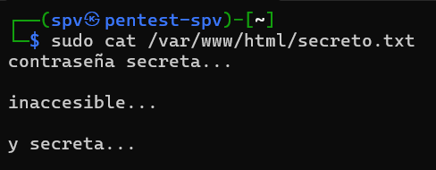
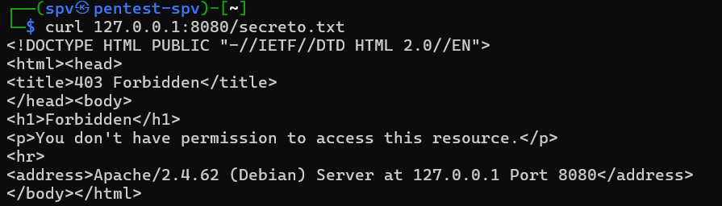
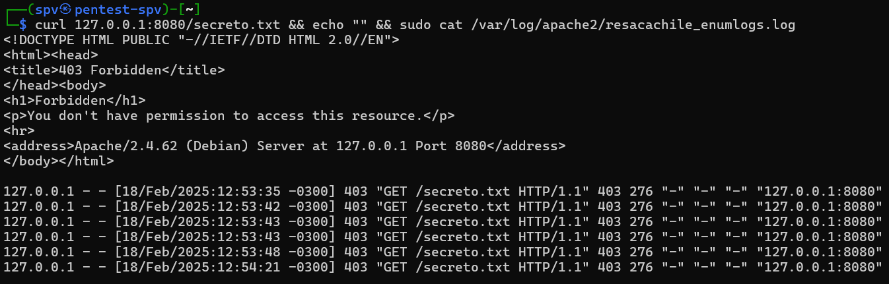

# monitoreo a la pobre: apache y rewrite engine

luego de unos meses sin escribir, creo que es momento de volver :) me había faltado la inspiración, pero realizando una que otra cosa, aparecen tópicos que me parecen interesantes presentarselos.

en este artículo, me gustaría hablar sobre el monitoreo de endpoints granular de Apache, su loggeo, y cómo hacerlo. veremos al final que no es complejo, y que si bien la documentación no es del todo clara, el resultado es genial.

apache 2: webserver por excelencia.

antes de comenzar, es bueno entender qué es apache y cómo funciona.

apache http, para quienes no lo conozcan, es un servidor web como nginx. su naturaleza modular le permite funcionar de varias maneras, pero principalmente permite servir rápidamente páginas en html, css y js, con la posibilidad de añadir elementos de php a través de los anteriormente mencionados módulos.

apache funciona en base a los llamados hosts virtuales o vhosts. estos son archivos de configuración que nos permiten crear dominios y subodminios virtuales, es decir, podemos servir varios sitios webs bajo varios diferentes dominios, todo bajo una misma dirección IP.

la configuración más básica de un host virtual se vería así:

```
<VirtualHost *:80>
    ServerName resacachile.cl
    DocumentRoot /var/www/html
</VirtualHost>
```

esta configuración básica establece tres directivas:

- VirtualHost: Esta directiva inicial establece que el host virtual correrá en todas las interfaces (* ) bajo el puerto 80.
- ServerName: El nombre del servidor. Es decir, un dominio. Este puede ser un dominio, subdominio o incluso una dirección IP. En este caso, es resacachile.cl.
- DocumentRoot: El DocumentRoot es la ruta desde donde se servirán archivos. En el ejemplo, la ruta es /var/www/html, por lo que al acceder al resacachile.cl/, se nos servirá el archivo /var/www/html/index.html.

Con esta base, podemos pasar a lo que son las reglas de registro.

**nota: esto es el conocimiento más fundamental y básico que existe de Apache. No es para nada recomendado simplemente llegar y servir un sitio web con la configuración presentada, ya que esta no desactiva el indexing de directorios. ¡Cuidado!**

## el rewrite engine.

el rewrite engine (mod_rewrite) es un módulo de Apache que nos permite manipular URLs de manera dináica. por ejemplo: si queremos que, al acceder a nuestro sitio web, se redirija nuestro usuario de / o /index.html a /pagina.html, utilizaríamos el rewrite engine para realizarlo. un ejemplo de esto es el siguiente:

```
RewriteEngine on
RewriteRule "\.txt$" "-" [F]
```

esta regla se compone de dos directivas y la segunda está compuesta de tres secciones.

- rewriteengine on: esto habilita el rewriteengine en nuestro vhost. esto es como decirle que se habilite y esté a la escucha de quienes entran a nuestro servidor.
- rewriterule: este es el inicio de la directiva de reescritura dinámica. veamos sus partes.
    - "\.txt$": esta es la primera sección de la regla, la cual está compuesta de una expresión regular sencilla o compuesta. en este caso, se busca cualquier URL que termina con ".txt".
    - "-": esta sección es la acción. cada vez que el rewrite engine se encuentre con esta regex (parámetro anterior), realiza este cambio. en este caso, el "-" indica al servidor no continuar sirviendo y devolver un 403.
    - [F]: este último y tercer parámetro se conoce como flag. estas son diversas, y la lista completa se encuentra aquí. en este caso, F se utiliza para que el parámetro anterior sea explícito. es decir, devuelve un 403 Forbidden.

con este entendimiento inicial, podemos escribir una regla de monitoreo rudimentario. si bien no es bonito, en casos donde no se tiene más que el servidor web, puede ser bastante útil, además de servir de control de acceso :)

## logformat y customlog.

el logformat y customlog nos permiten establecer dos parámetros importantes: la estructura de nuestros eventos, ubicación y contenido. una regla par sencilla sería la siguiente:

LogFormat "%h %l %u %t \"%r\" %>s %b" common
CustomLog /var/log/apache/resacachile.cl_access.log common

se ve un tanto complejo, pero si alguna vez han utilizado el comando "date" con parámetros temporales como %D, la dinámica les será familiar. sin embargo, veamos que significa cada parámetro en este caso.

- **%h**: hostname remoto.
- **%l**: identidad. usualmente queda en "-".
- **%u**: de estar autenticado, da el usuario. pocas veces funciona :)
- **%t**: timestamp de la petición.
- **\"%r\"**: primera línea de la petición. usualmente "GET / HTTP/1.1" u otro derivado.
- **%>s**: si no tuviese >, sería el estado. con >, es el estado final de la petición.
- **%b**: tamaño de la respueta.
- **common**: es el nickname del formato. se utiliza common en este caso, ya que este es el nickname del logformat por defecto, pero podría ser cualquier cosa.

una lista completa de potenciales modificadores se encuentra aquí.

customlog es más sencillo.

- /var/log/apache/resacachile.cl_access.log: la ubicación donde se almacenarán los logs junto con el nombre del archivo.
- common: el formato a guardar. si bien se podría establecer un formato como en logformat, la práctica estándar es establecerla de manera previa y llamarla por nickname.

## rewritengine y la flag E.

¿qué hace este parámetro? establece una variable de entorno dentro del host virtual. eso es todo :) es la escencial pieza que nos permitirá crear nuestras reglas de monitoreo. veamos que hace.

```
RewriteEngine on
RewriteRule "\.txt$" "-" [E=nombrevariable:valorvariable]
```

ya conocemos que hacen gran parte de estos parámetros, asi que saltemos a lo que desconocemos.

- [E:nombrevariable:valorvariable]: tal y como se mencionó anteriormente, lo que va entre corchetes son las flags de la regla. en este caso, utilizamos la flag E, la cual nos permite establecer una variable de entorno dentro del host virtual. lo que es nombrevariable y valorvariable creo que se entiende, pero de no entenderse, el primer valor constituye el nombre de la variable y el segundo el contenido de esta.

con todas estas piezas juntas, podemos finalmente crear una regla de monitoreo.

## creemos una regla.

en un caso real, primero necesitaremos saber qué nos interesa monitorear. cuando muestro la regla de los .txt, es por un uso que me ha venido como anillo al dedo en varias ocasiones, especialmente cuando tengo que armar entornos Moodle. en ese contexto, una forma sencilla de enumerar versiones, licencias y otros datos varios, es a través de archivos .txt que vienen con Moodle. si bien estos archivos pueden ser eliminados, un atacante puede intentar acceder a estos archivos de igual manera, por lo que monitorear estos recursos es igual de importante que eliminarlos.

```
RewriteEngine on
RewriteRule "\.txt$" "-" [E=ataque:enumeracion]

# no se obfusquen con esto. miren la documentación que les entregué previamente y entenderán :)
LogFormat "%h %l %u %t %s \"%r\" %>s %b \"%{Referer}i\" \"%{UserAgent}i\" \"%{Cookie}i\" \"%{Host}i\"" enumeration_logs

RewriteRule "\.txt$" "-" [F]

CustomLog /var/log/apache2/resacachile_enumlogs.log enumeration_logs env=ataque
```


estas pocas líneas de configuración realizarán el siguiente flujo:

- la primera rewriterule nos ayuda a detectar y almacenar el acceso al recurso.
- la segunda rewriterule restringe el acceso luego de detectarlo.
- el customlog almacena finalmente en disco el evento.
- cabe destacar: env=ataque se utilia para correlacionar el evento con el formato personalizado. de esta manera, almacenamos los logs que nos interesan :)

antes de reiniciar el servicio, debemos habilitar el modulo con el comando a2enmod rewrite. con la regla escrita (y ejecutando apachectl configtest si estamos en producción), ya podemos reiniciar el servicio.

para la prueba, creé un archivo txt en el DocumentRoot:



revisamos el archivo creado en /var/www/html/secreto.txt

ahora, al intentar acceder a este archivo, el cual es teóricamente accesible desde la web, la instancia de apache nos dará un 403 Forbidden.



hacemos una llamada a 127.0.0.1:8080/secreto.txt y recibimos un 403.



lo mismo que arriba, solo que también vemos el log de eventos que creamos.

con esto, la regla está finalizada y funcional :)

## ¿y ahora qué?

como proyecto, les recomiendo aprender a utilizar sendmail junto con cron. con estas herramientas, pueden crear un sistema de alerta a través de correos electrónicos periódicos. ¿rudimentario? si. ¿funcional? por supuesto.

## conclusión.

como hemos visto, no necesitamos grandes herramientas que consumen tiempo y recursos para tener un sistema de monitoreo. solo se necesita ingenio, estudio y paciencia :)

